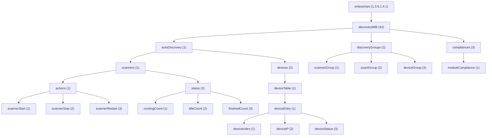

# Árvore de Objetos da MIB

```mermaid
---
id: a0290fdb-5376-41c6-9289-9b6519d20968
---
graph TD
    enterprises["enterprises (1.3.6.1.4.1)"]
    discoveryMIB["discoveryMIB (42)"]
    autoDiscovery["autoDiscovery (1)"]
    scanners["scanners (1)"]
    actions["actions (1)"]
    scannerStart["scannerStart (1)"]
    scannerStop["scannerStop (2)"]
    scannerRestart["scannerRestart (3)"]
    status["status (2)"]
    runningCount["runningCount (1)"]
    idleCount["idleCount (2)"]
    finishedCount["finishedCount (3)"]
    devices["devices (2)"]
    deviceTable["deviceTable (1)"]
    deviceEntry["deviceEntry (1)"]
    deviceIndex["deviceIndex (1)"]
    deviceIP["deviceIP (2)"]
    deviceStatus["deviceStatus (3)"]
    discoveryGroups["discoveryGroups (2)"]
    scannerGroup["scannerGroup (1)"]
    countGroup["countGroup (2)"]
    deviceGroup["deviceGroup (3)"]
    compliances["compliances (3)"]
    moduleCompliance["moduleCompliance (1)"]

    enterprises --> discoveryMIB
    discoveryMIB --> autoDiscovery
    autoDiscovery --> scanners
    scanners --> actions
    actions --> scannerStart
    actions --> scannerStop
    actions --> scannerRestart
    scanners --> status
    status --> runningCount
    status --> idleCount
    status --> finishedCount
    autoDiscovery --> devices
    devices --> deviceTable
    deviceTable --> deviceEntry
    deviceEntry --> deviceIndex
    deviceEntry --> deviceIP
    deviceEntry --> deviceStatus
    discoveryMIB --> discoveryGroups
    discoveryGroups --> scannerGroup
    discoveryGroups --> countGroup
    discoveryGroups --> deviceGroup
    discoveryMIB --> compliances
    compliances --> moduleCompliance
```
